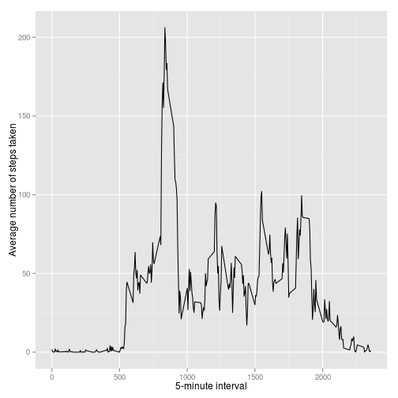
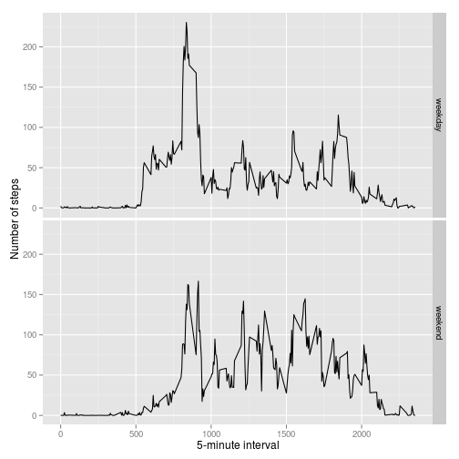

# Reproducible Research Assessment 1

## Introduction

This document shows how to reproduce a research, following as learned at Reproducible Research course at Coursera website.

### Loading and preprocessing the data
Fist, we need to load the data:


```r
setwd("~/coursera/reproducible research/assesment1v2")
url="https://d396qusza40orc.cloudfront.net/repdata%2Fdata%2Factivity.zip"
#download.file (url, destfile = "repdata.zip", method="wget")
#unzip ("repdata.zip")
data=read.csv("activity.csv", header = T)
```

### What is mean total number of steps taken per day?
After load raw data, it needs to be processed. Steps will be grouped by days, with aggregate function as shown here:


```r
steps=aggregate(steps ~ date, data, sum)
```


Now, plotting the result with a histogram:


```r
hist(steps$steps, xlab = "Steps per day")
```

 


To calculate the mean:


```r
mean(steps$steps, na.rm = TRUE)
```

```
## [1] 10766.19
```

To calculate the median:


```r
median(steps$steps, na.rm = TRUE)
```

```
## [1] 10765
```


### What is the average daily activity pattern?


```r
library(ggplot2)
avg=aggregate (x=list(steps=data$steps), by=list(interval=data$interval), FUN=mean, na.rm=T)
ggplot(avg,aes(x=interval, y=steps))+ geom_line() + xlab("5-minute interval") +     ylab("Average number of steps taken")
```

 

The maximun number of steps are on the following interval, with number of steps:


```r
avg[which.max(avg$steps), ]
```

```
##     interval    steps
## 104      835 206.1698
```


### Imputing missing values

How much values are not available in dataset?


```r
sum(is.na(data$steps))
```

```
## [1] 2304
```


Filling data on records with NA value:

First, copy original dataset:

```r
datafull = data
```

Second, apply a function to fill a value on a NA record:


```r
fill = function(steps, interval) {
  filled = NA
  if (!is.na(steps)) 
    filled = c(steps) else filled = (avg[avg$interval == interval, "steps"])
  return(filled)
}
datafull$steps=mapply(fill, datafull$steps, datafull$interval)
```

Finnaly, reproduce same steps on the dataset full:


```r
steps=aggregate(steps ~ date, datafull, sum)
```


Now, plotting the result with a histogram:


```r
hist(steps$steps, xlab = "Steps per day")
```

 


To calculate the mean:


```r
mean(steps$steps, na.rm = TRUE)
```

```
## [1] 10766.19
```
To calculate the median:


```r
median(steps$steps, na.rm = TRUE)
```

```
## [1] 10766.19
```


### Are there differences in activity patterns between weekdays and weekends?


For this, first we need to know what day of week for each record:


```r
weekday.or.weekend <- function(date) {
  day <- weekdays(date)
  if (day %in% c("Monday", "Tuesday", "Wednesday", "Thursday", "Friday")) 
    return("weekday") else if (day %in% c("Saturday", "Sunday")) 
      return("weekend") else stop("invalid date")
}
datafull$date <- as.Date(datafull$date)
datafull$day <- sapply(datafull$date, FUN = weekday.or.weekend)
```

After that, we need to group by weekend or workday:


```r
averages <- aggregate(steps ~ interval + day, data = datafull, mean)
```

And finnaly, compare results:


```r
ggplot(averages, aes(interval, steps)) + geom_line() + facet_grid(day ~ .) + 
  xlab("5-minute interval") + ylab("Number of steps")
```

 
